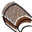
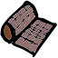
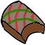
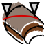
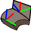
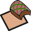
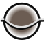
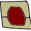

#  FreeCAD Composite Workbench

This is a workbench for FreeCAD to support design and structural analysis of thin composite
laminate structures.

This is very much a work in progress.  A lot is subject to change or refactoring.
Lots of code needs unit testing and handling input errors.

This requires a modified version of FreeCAD, mainly to support FEM analysis.
  https://github.com/jwharington/FreeCAD/tree/fem-orthotropic

## Composite material composition

###  FibreCompositeLamina 

- Element for fibre composite
- Classical theory for fibre reinforced material properties
- Various material fabrics (uni, bidirectional etc)

###  HomogeneousLamina 

- Element for homogeneous (one part) core material
- May be orthotropic or isotropic

###  Laminate 

- Element for homogeneous (single part) layered composites
- Classical Laminate Theory merging of laminates
- Symmetric (odd, even) and non-symmetric layups

###  CompositeLaminate 

- Elements for fibre reinforced composites

## Composite structure

###  CompositeShell 

- Construction of shells in laminate materials
- LCS varies across the laminate shell by draping material
- Visualisation of fibre orientation across the part 
- Visualisation of fabric draping strains across the part

###  Seam 

- Tool for creating seam/overlap/transition regions

###  Stiffener 

- Tool for constructing stiffeners with custom profiles

## Fibre orientation

###  AlignFibreLCS 

- Tool for aligning zero fibres 

###  TransferLCS 

- Tool for managing fibre orientations across cut lines like seams

###  WrapLCS 

- Tool for managing fibre orientations around edges with matching fibre orientation

## Manufacturing

###  TexturePlan 

- Construction of aligned texture plans for layup

###  PartPlane 

- Some preliminary work on constructing part lines/planes

###  Mould 

- Some preliminary work on constructing moulds

## Works in progress

###  Dart
- Tool for cutting darts and creating seam/overlap/transition regions

## Analysis tools:
- Analysis tools such as average fibre length, % of plies in each orientation

## Finite element analysis:

- Local coordinate system with orthotropic materials in FreeCAD FEM solver
- Composite material support in FreeCAD FEM using Calculix solver
- Computation of FEM stress exposure factor calculations including stress/strain/Tsai-hill

## TODO, notes

- Refactoring to allow use of lower-level code without FeaturePython objects/gui
- Design rules
- Hybrid (2 fibre material) fabrics
- Failure modes implement as plug in to FEM
- CompositeShell should have code sensitive to whether laminate is Fibre
- Seam detection and splitting when unwrap fails or high strain
  - Mesh_PolyCut
- Scale expand drape if positive linear strain
  .scale
- TexturePlan
  - add easement
  - add overlaps at darts?
  
Terminology:
- splice
- butt joint
- joint

 https://compositematerialshub.com/bonded-joints/
 
 use CreateLabels.py from FEM for displaying layers?
